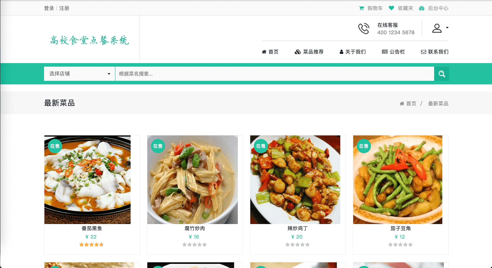
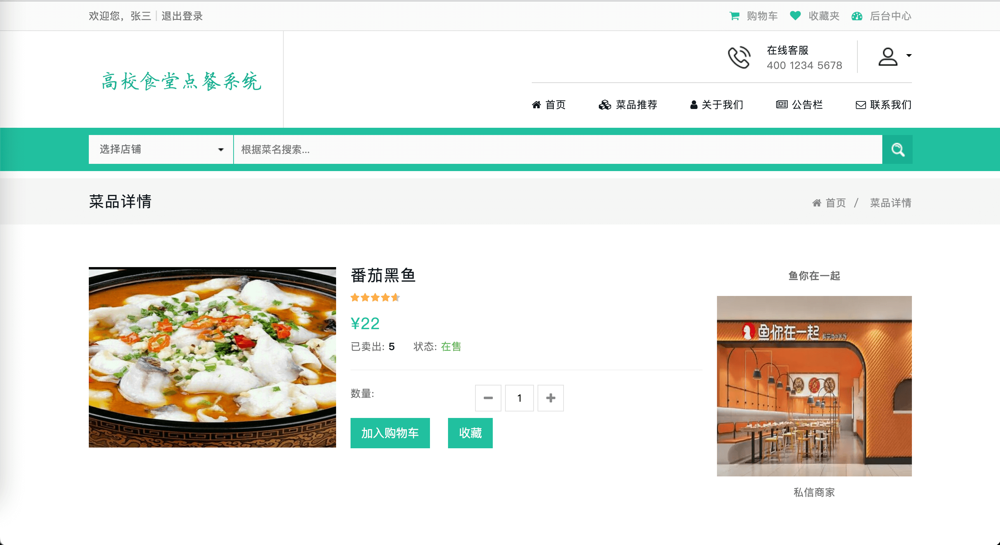
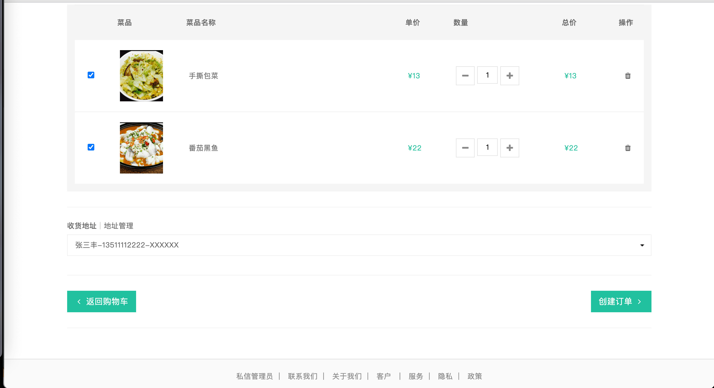
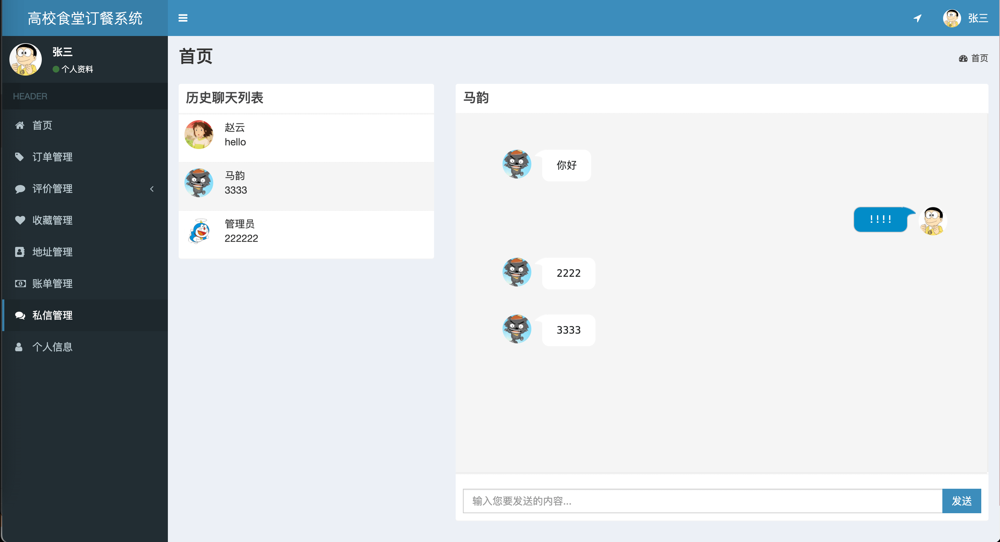
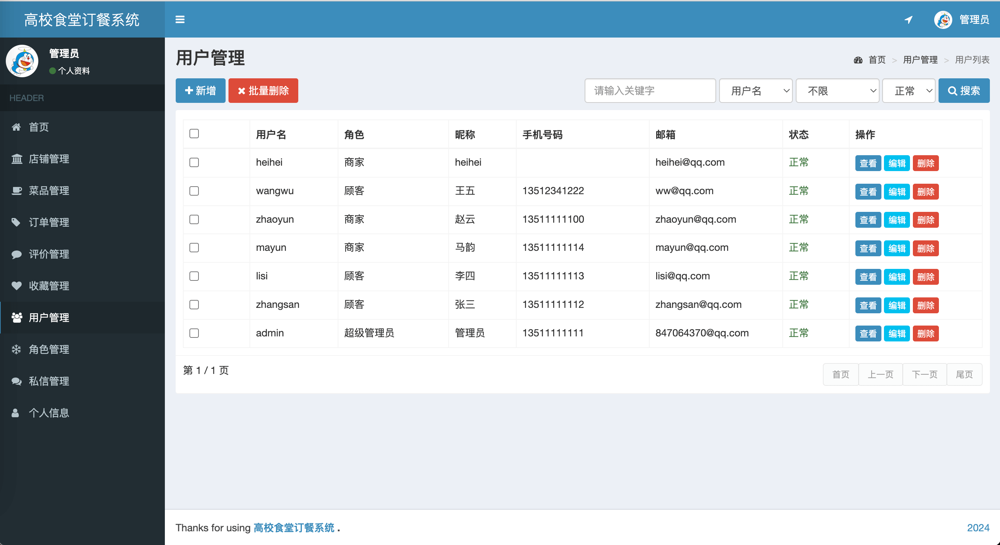
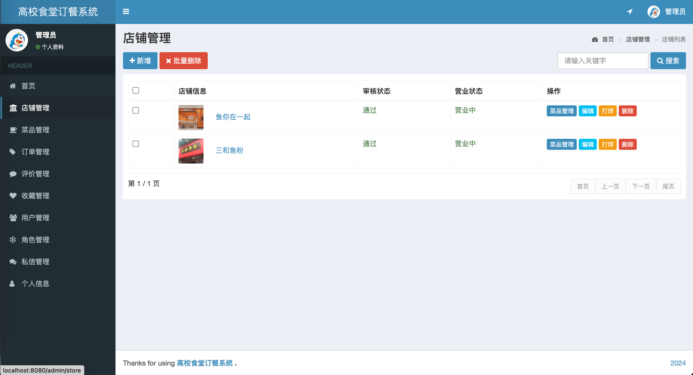
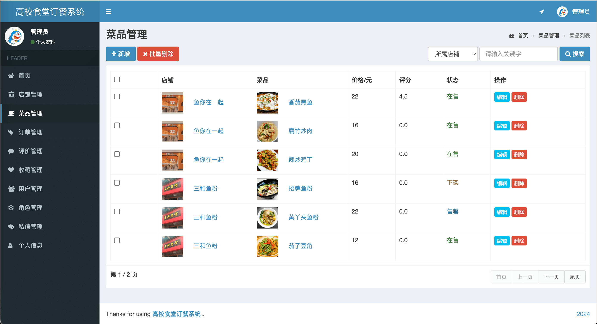

- 2024 基于SpringBoot的大学食堂点餐系统 在线点餐系统
- 预览地址：[http://diancan.liuyanzhao.com](http://diancan.liuyanzhao.com) 
- 详细介绍地址：[https://liuyanzhao.com/shop/diancan.html](https://liuyanzhao.com/shop/diancan.html)
- 演示视频：链接:https://pan.baidu.com/s/1FKQqb2S6MihW_1-C8nBIXA  密码:1xka


# 一、用户需求
```
管理员：（管理员不能下单）
    首页
    店铺管理  - 所有店铺
    菜品管理  - 所有店铺的菜品
    订单管理  - 所有订单
    用户管理
    角色管理
    私信管理
    个人信息

商家：（ 商家不能下单）
    首页
    店铺管理  - 自己的店铺
    菜品管理  - 自己的店铺的菜品
    订单管理  - 自己店铺的菜单
    订单评价管理  - 自己店铺的菜单的评价
    账单管理  - （收入）
    私信管理
    个人信息

顾客：（顾客不能开通店铺）
    首页
    订单管理  - 自己创建的订单
    收藏管理  - 自己收藏的菜品
    地址管理  - 自己的地址
    订单评价管理  - 待评价/已评价
    账单管理  - （支出）
    私信管理
    个人信息
```


# 二、技术组成
- 1、SpringBoot 
- 2、MyBatis / MyBatis Plus
- 3、Thymeleaf
- 4、Bootstrap
- 5、MySQL

# 三、项目部分功能截图
1-首页.png

2-菜品详情.png

3-购物车页面.png

4-结算页面.png

5-客户订单列表.png

6-评价列表.png

7-私信管理.png

8-用户管理.png

9-店铺管理.png

10-菜品管理.png


# 四、联系方式
需要完整代码联系博主，微信847064370


